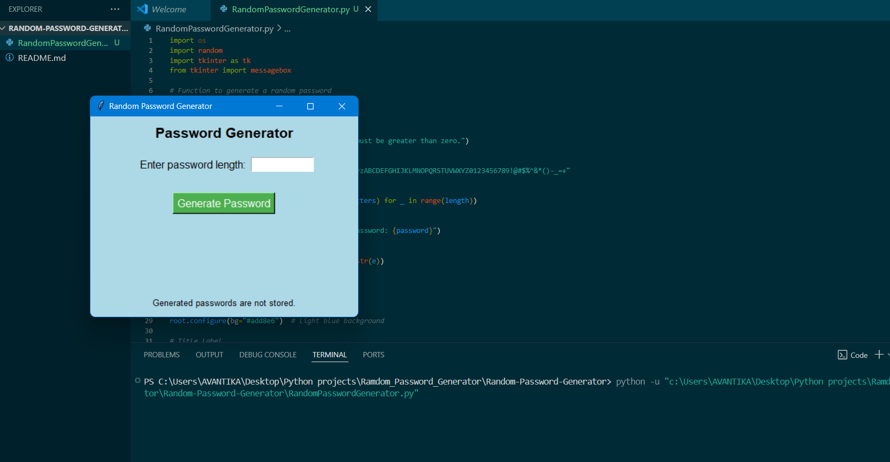
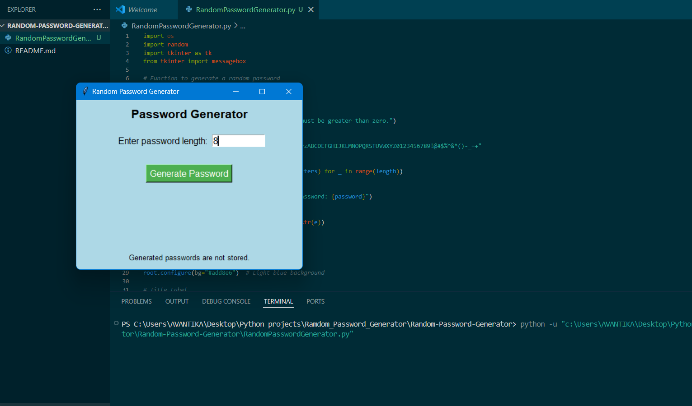
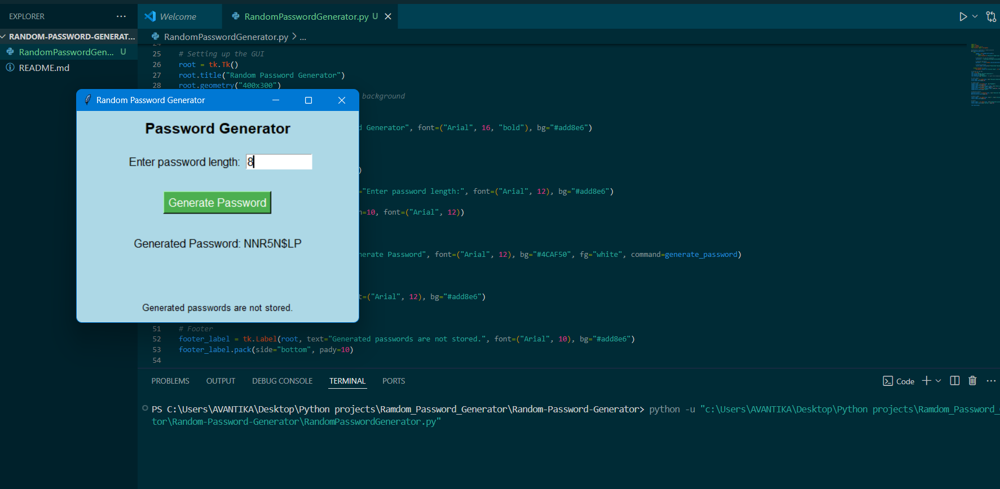

# Random Password Generator

A simple Python-based GUI application that generates random passwords of specified lengths using `os` and `random`.

## Features
- Generates strong passwords using a mix of alphabets, numbers, and special characters.
- User-friendly GUI built with `Tkinter`.
- Secure password generation using `random.choice()` and `os.urandom()`.

## Technologies Used
- Python 3.x
- tkinter (comes pre-installed with Python)
- os module

## How to Use
1. Clone the repository:
    ```bash
    git clone https://github.com/your-username/random-password-generator.git
    cd random-password-generator
    ```

2. Run the script:
    ```bash
    python password_generator.py
    ```

3. Enter the desired password length in the input field and click **Generate Password**.

## Example
Below is a screenshot of the application in action:

  
